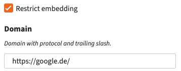

# PeerTube plugin private embedding

This plugin restricts the visibility of a not listed video to be embedded on a certain domain.

When selecting "Not listed" from the privacy options, the user can check a box to activate the private embedding:

If checked, the video can no longer be viewed without being embedded on the domain entered in the respective input field.
